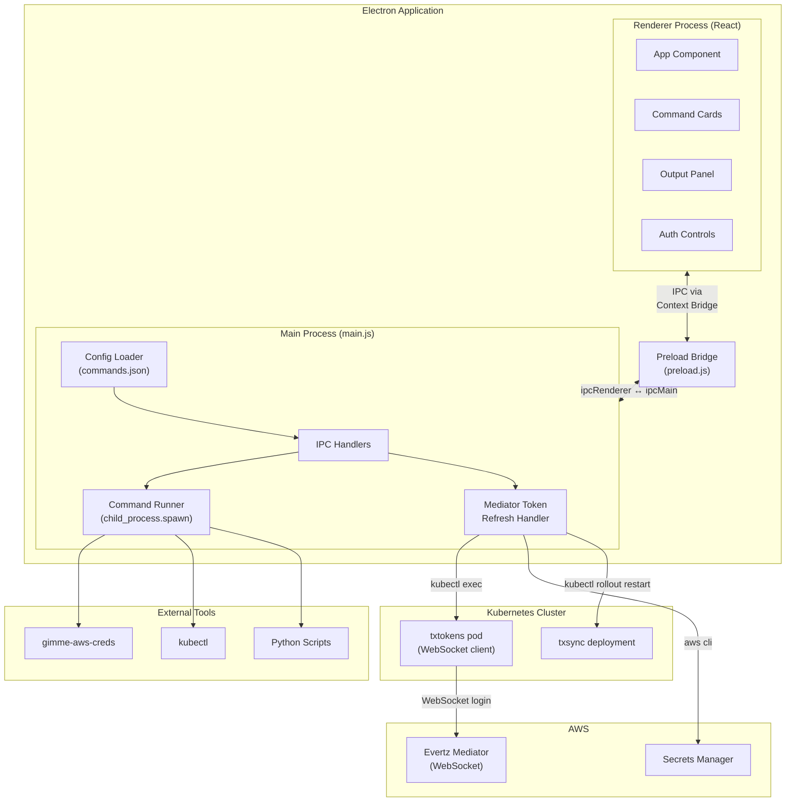
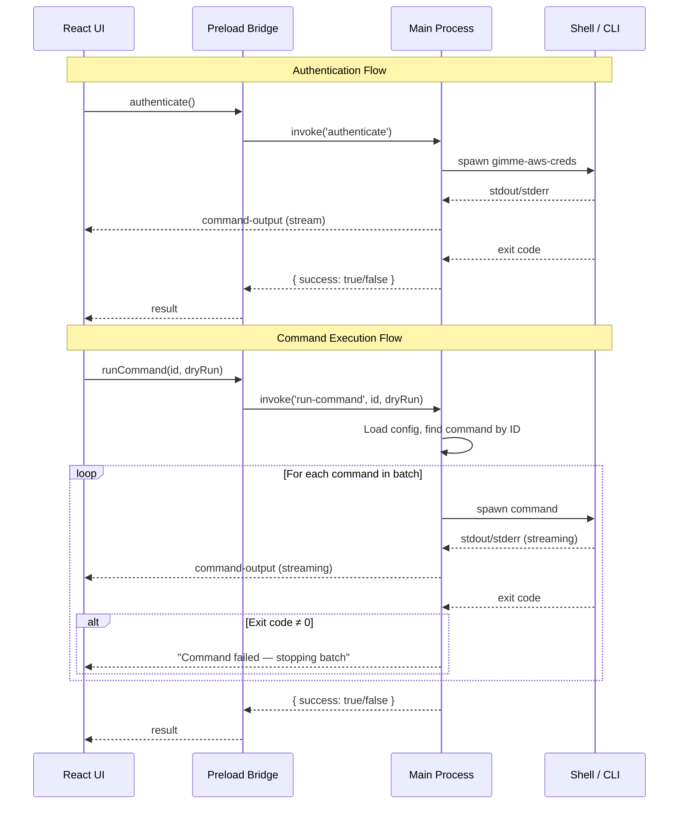
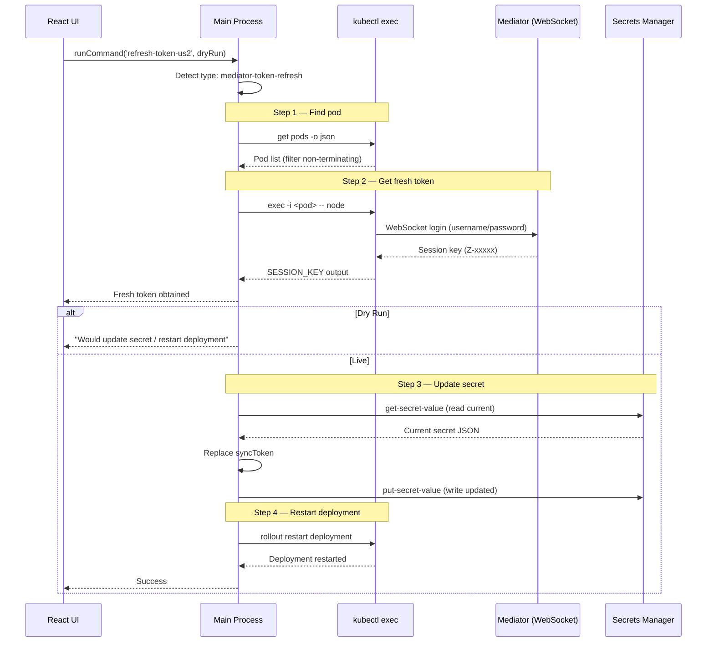
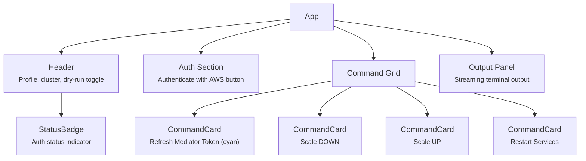

# Kube Commander

A desktop application for managing Kubernetes deployments and AWS authentication. Provides a simple, button-driven UI for common operational tasks like scaling services and restarting deployments, removing the need to remember and type complex CLI commands.

## Architecture

Kube Commander is built on Electron with a React frontend. The main process handles shell command execution and AWS authentication, while the renderer process provides the interactive UI. Communication between the two layers is handled via Electron's IPC mechanism, secured with context isolation.

### High-Level Architecture



### IPC Communication Flow



### Mediator Token Refresh Flow



### UI Component Structure



## Project Structure

```
kube-commander/
├── main.js                  # Electron main process — IPC handlers, command execution
├── preload.js               # Context bridge — secure API exposed to renderer
├── index.html               # HTML entry point
├── commands.json             # Your local config (git-ignored)
├── commands.example.json    # Template config (safe to commit)
├── package.json
├── vite.config.mjs          # Vite build configuration
├── start.bat                # Windows launcher script
├── src/
│   ├── main.jsx             # React entry point
│   ├── App.jsx              # Main UI — all components and logic
│   └── index.css            # Tailwind CSS imports
└── dist/                    # Vite build output (git-ignored)
```

## Tech Stack

| Layer      | Technology        |
|------------|-------------------|
| Runtime    | Electron 33       |
| UI         | React 19          |
| Styling    | Tailwind CSS v4   |
| Build      | Vite 6            |

## Getting Started

### Prerequisites

- Node.js (v18+)
- npm
- `gimme-aws-creds` installed and configured
- `kubectl` binary accessible

### Setup

1. Clone the repository
2. Install dependencies:
   ```bash
   npm install
   ```
3. Copy the example config and fill in your values:
   ```bash
   cp commands.example.json commands.json
   ```
4. Edit `commands.json` with your AWS profile, account ID, cluster name, kubectl path, and deployment names.

### Running

```bash
npm start
```

Or on Windows, use the included batch file:

```bash
start.bat
```

## Configuration

All operational settings live in `commands.json`. This file is git-ignored to keep sensitive information out of version control.

| Field         | Description                                      |
|---------------|--------------------------------------------------|
| `profile`     | AWS profile name for `gimme-aws-creds`           |
| `stage`       | Environment stage (e.g. `prod`, `staging`)       |
| `account`     | AWS account ID                                   |
| `cluster`     | Kubernetes cluster name                          |
| `region`      | AWS region                                       |
| `kubectlPath` | Absolute path to `kubectl` binary                |
| `mediator`    | Mediator token refresh config (see below)        |
| `commands`    | Array of command definitions (see below)         |

### Command Definition

Each entry in the `commands` array supports:

| Field         | Required | Description                                                |
|---------------|----------|------------------------------------------------------------|
| `id`          | Yes      | Unique identifier                                          |
| `label`       | Yes      | Button label displayed in the UI                           |
| `description` | Yes      | Short description shown on the command card                |
| `commands`    | Yes*     | Array of shell commands to run sequentially                |
| `variant`     | No       | `"danger"` (red), `"success"` (green), or default (blue)  |
| `cwd`         | No       | Working directory for command execution                    |
| `type`        | No       | Set to `"mediator-token-refresh"` for token refresh commands |
| `mediatorInstance` | No  | Name of the mediator instance (required when `type` is `mediator-token-refresh`) |
| `steps`       | No       | Array of step descriptions shown on the card instead of commands |

\* Not required when `type` is `"mediator-token-refresh"`.

### Mediator Token Refresh

The app can refresh Evertz Mediator session tokens that are used by the playlist sync service. This automates what would otherwise be a multi-step manual process: connecting to the Mediator via WebSocket, obtaining a fresh session key, updating the secret in AWS Secrets Manager, and restarting the sync deployment.

Configure the `mediator` section in `commands.json`:

| Field                      | Description                                                  |
|----------------------------|--------------------------------------------------------------|
| `mediator.namespace`       | Kubernetes namespace where the pods run (e.g. `"go"`)        |
| `mediator.username`        | Mediator login username                                      |
| `mediator.password`        | Mediator login password                                      |
| `mediator.instances`       | Array of Mediator instance definitions                       |
| `instances[].name`         | Instance identifier (e.g. `"us2"`)                           |
| `instances[].wsUrl`        | WebSocket URL for Mediator login                             |
| `instances[].syncUrl`      | HTTP URL for the playlist sync manager API                   |
| `instances[].secretId`     | AWS Secrets Manager secret path                              |
| `instances[].tokensPod`    | Pod name prefix for the tokens service (used for `kubectl exec`) |
| `instances[].syncDeployment` | Deployment name to restart after token update              |

The token refresh command performs these steps:

1. **Find pod** — locates a running (non-terminating) pod matching the `tokensPod` prefix
2. **Get fresh token** — pipes a WebSocket login script into the pod via `kubectl exec`, connecting to the Mediator and obtaining a new session key
3. **Update secret** (live only) — reads the current secret from Secrets Manager, replaces the `syncToken` field, and writes it back
4. **Restart deployment** (live only) — runs `kubectl rollout restart` on the sync deployment so it picks up the new token

### Dry Run Mode

The UI includes a dry-run toggle (enabled by default). Behavior varies by command type:

- **Shell commands**: `kubectl` commands are appended with `--dry-run=client`. Non-kubectl commands are unaffected.
- **Mediator token refresh**: Steps 1-2 always execute (read-only — finds the pod and verifies the Mediator login works). Steps 3-4 (updating the secret and restarting the deployment) are skipped with a message showing what would happen.

## Security Notes

- `commands.json` is git-ignored — it contains environment-specific values like AWS account IDs, internal service names, and Mediator credentials
- `commands.example.json` is provided as a safe-to-commit template with placeholder values
- Context isolation is enabled in Electron — the renderer has no direct access to Node.js APIs
- No AWS credentials are stored in the app — authentication is handled at runtime via `gimme-aws-creds`
- Mediator credentials in `commands.json` are read from the local config file only and are never logged to the output panel
- Temporary files used during secret updates (written to the OS temp directory) are deleted immediately after use
