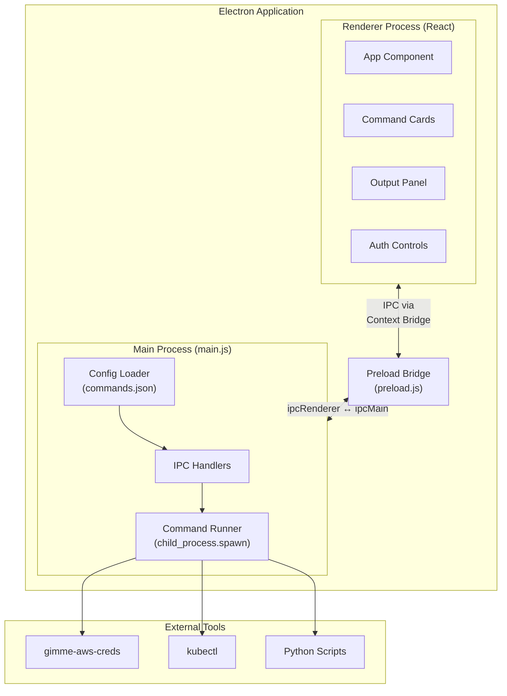
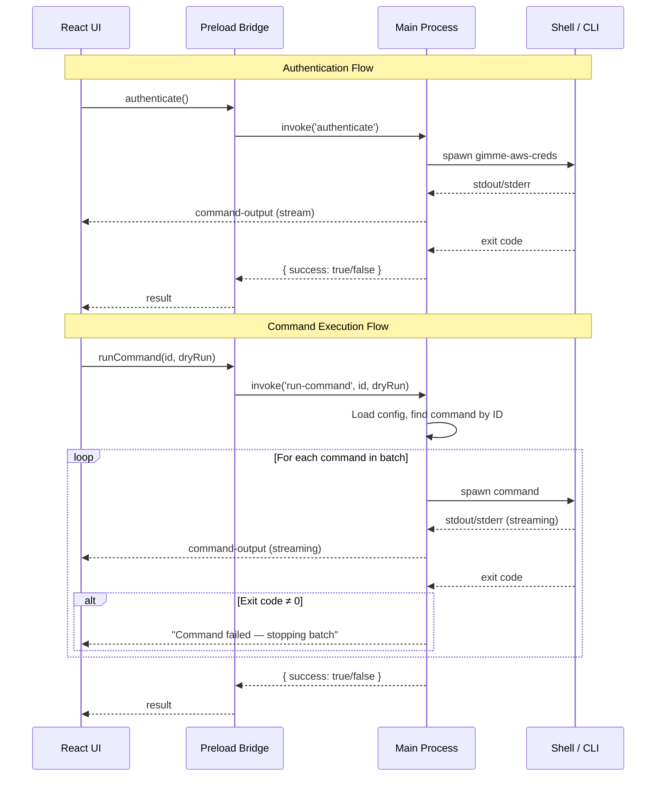
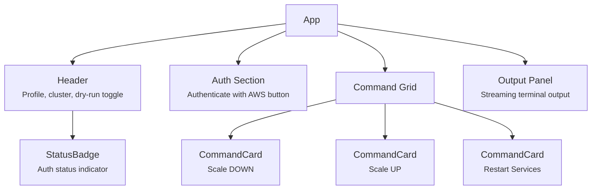

# Kube Commander

A desktop application for managing Kubernetes deployments and AWS authentication. Provides a simple, button-driven UI for common operational tasks like scaling services and restarting deployments, removing the need to remember and type complex CLI commands.

## Architecture

Kube Commander is built on Electron with a React frontend. The main process handles shell command execution and AWS authentication, while the renderer process provides the interactive UI. Communication between the two layers is handled via Electron's IPC mechanism, secured with context isolation.

### High-Level Architecture



### IPC Communication Flow



### UI Component Structure



## Project Structure

```
kube-commander/
├── main.js                  # Electron main process — IPC handlers, command execution
├── preload.js               # Context bridge — secure API exposed to renderer
├── index.html               # HTML entry point
├── commands.json             # Your local config (git-ignored)
├── commands.example.json    # Template config (safe to commit)
├── package.json
├── vite.config.mjs          # Vite build configuration
├── start.bat                # Windows launcher script
├── src/
│   ├── main.jsx             # React entry point
│   ├── App.jsx              # Main UI — all components and logic
│   └── index.css            # Tailwind CSS imports
└── dist/                    # Vite build output (git-ignored)
```

## Tech Stack

| Layer      | Technology        |
|------------|-------------------|
| Runtime    | Electron 33       |
| UI         | React 19          |
| Styling    | Tailwind CSS v4   |
| Build      | Vite 6            |

## Getting Started

### Prerequisites

- Node.js (v18+)
- npm
- `gimme-aws-creds` installed and configured
- `kubectl` binary accessible

### Setup

1. Clone the repository
2. Install dependencies:
   ```bash
   npm install
   ```
3. Copy the example config and fill in your values:
   ```bash
   cp commands.example.json commands.json
   ```
4. Edit `commands.json` with your AWS profile, account ID, cluster name, kubectl path, and deployment names.

### Running

```bash
npm start
```

Or on Windows, use the included batch file:

```bash
start.bat
```

## Configuration

All operational settings live in `commands.json`. This file is git-ignored to keep sensitive information out of version control.

| Field         | Description                                      |
|---------------|--------------------------------------------------|
| `profile`     | AWS profile name for `gimme-aws-creds`           |
| `stage`       | Environment stage (e.g. `prod`, `staging`)       |
| `account`     | AWS account ID                                   |
| `cluster`     | Kubernetes cluster name                          |
| `region`      | AWS region                                       |
| `kubectlPath` | Absolute path to `kubectl` binary                |
| `commands`    | Array of command definitions (see below)         |

### Command Definition

Each entry in the `commands` array supports:

| Field         | Required | Description                                                |
|---------------|----------|------------------------------------------------------------|
| `id`          | Yes      | Unique identifier                                          |
| `label`       | Yes      | Button label displayed in the UI                           |
| `description` | Yes      | Short description shown on the command card                |
| `commands`    | Yes      | Array of shell commands to run sequentially                |
| `variant`     | No       | `"danger"` (red), `"success"` (green), or default (blue)  |
| `cwd`         | No       | Working directory for command execution                    |

### Dry Run Mode

The UI includes a dry-run toggle (enabled by default). When active, `kubectl` commands are appended with `--dry-run=client` so you can verify what would happen without making changes. Non-kubectl commands are unaffected by this toggle.

## Security Notes

- `commands.json` is git-ignored — it contains environment-specific values like AWS account IDs and internal service names
- `commands.example.json` is provided as a safe-to-commit template
- Context isolation is enabled in Electron — the renderer has no direct access to Node.js APIs
- No credentials are stored in the app — authentication is handled at runtime via `gimme-aws-creds`
